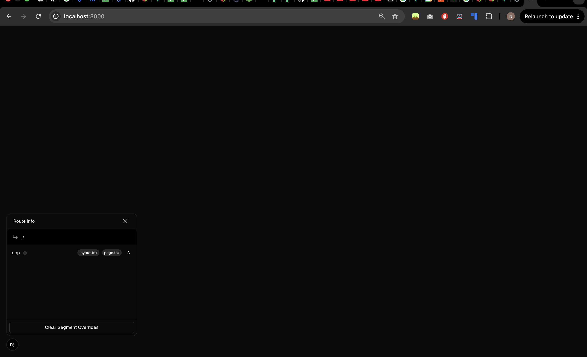

# Software Engineering Project

> Weekly Log - Individual Submission

<br>

| Name         | Team | Student ID |
| ------------ | ---- | ---------- |
| `Nicole Low` | NA   | `2526889A` |

<br>

## Week 0 - (Week of 12 Jan)

### 1 - Objectives of the Week (1 mark)

> _(List the key goals or tasks planned for this week)_

1. Settle on a project idea
2. Decide tech stack

<br>

### 2 - Activities Completed for the Week (1 mark)

> _(Describe developments done, including methods, tools, and technologies. Please provide screenshots where applicable.)_

- [x] Settle on a project idea
- [x] Decide tech stack

<br>

### 3 - Challenges Encountered (1 mark)

> _(Mention any difficulties or issues faced and how they were addressed)_

- Challenge 1: Settling on 1 idea and the scope to be implemented.
    - I have many features and libraries I wanted to try out (e.g. three.js , telegram bot integration) But given the limited amount of time, I decided to build on top of what I was already familiar with and implement features that were feasible to acheive within the current timeline.
- Challenge 2: Figuring out the appropriate tech stack to use.
    - I knew I wanted to host my webapp serverlessly on Vercel, but wasn't sure what would be the appropriate tech stack / database to use. After some research, I chose Supabase over MS SQL primarily because serverless environments like Vercel are stateless and ephemeral. Since my application instances spin up and down dynamically to handle requests, traditional databases like MS SQL would struggle with connection — the new serverless function attempting to open a heavy, persistent connection, something that the database cannot handle at scale.
      <br>

### 4 - Reflections (1 mark)

> _(Did you receive any feedback from your teammates, and how did you address or resolve it? Did you manage to complete the tasks you intended to finish this week? What will be your top priority for next week?)_

```
I managed to complete the tasks I set out for myself this week.
My priority next week would be to:
- (1) Complete the low resolution wireframe and
- (2) Set up the environment for my web app
```

## Week 1 - (Week of 19 Jan)

### 1 - Objectives of the Week (1 mark)

> _(List the key goals or tasks planned for this week)_

1. Complete wireframe
2. Set up the environment
3. Start code implementation

<br>

### 2 - Activities Completed for the Week (1 mark)

> _(Describe developments done, including methods, tools, and technologies. Please provide screenshots where applicable.)_

- [x] Complete wireframe
- [x] Start code implementation

<br>

### 3 - Challenges Encountered (1 mark)

> _(Mention any difficulties or issues faced and how they were addressed)_

- Challenge 1
    - I am able to view my html when i open it with live server in Visual Studio Code, but not able to see it when I run the node.js server. Will need to troubleshoot this over the course of next week.
    - 
    - 

<br>

### 4 - Reflections (1 mark)

> _(Did you receive any feedback from your teammates, and how did you address or resolve it? Did you manage to complete the tasks you intended to finish this week? What will be your top priority for next week?)_

```
I managed to complete 2/3 of my tasks, I will be focusing on getting the environment set up right next week as well as implementing the login authentication feature.
```

<br>

---

## Week 2 - (Week of 26 Jan)

### 1 - Objectives of the Week (1 mark)

> _(List the key goals or tasks planned for this week)_

1. Objective #1
2. Objective #1
3. Objective #1

<br>

### 2 - Activities Completed for the Week (1 mark)

> _(Describe developments done, including methods, tools, and technologies. Please provide screenshots where applicable.)_

- [ ] Uncompleted Activity
- [x] Completed Activities

<br>

### 3 - Challenges Encountered (1 mark)

> _(Mention any difficulties or issues faced and how they were addressed)_

- Challenge 1:
    - Realised that the html was not linked to my code
- Challenge 2

<br>

### 4 - Reflections (1 mark)

> _(Did you receive any feedback from your teammates, and how did you address or resolve it? Did you manage to complete the tasks you intended to finish this week? What will be your top priority for next week?)_

```
Reflection
```

<br>

---

## Week 3 - (Week of 02 Feb)

### 1 - Objectives of the Week (1 mark)

> _(List the key goals or tasks planned for this week)_

1. ✅ Connect database to project
2. Setup Login authentication
3. Start implementing features for Transactions
    - Feature to filter transactions
    - Feature to download csv files
4. Start implementing features for Overview
    - Figure out how to implement charts
5. Implement Habits page
6. Implement points system
7. Implement Product Page
8. Implement Product Redemption modal

<br>

### 2 - Activities Completed for the Week (1 mark)

> _(Describe developments done, including methods, tools, and technologies. Please provide screenshots where applicable.)_

- [ ] Uncompleted Activity
- [x] Completed Activities

<br>

### 3 - Challenges Encountered (1 mark)

> _(Mention any difficulties or issues faced and how they were addressed)_

- Challenge 1
- Challenge 2

<br>

### 4 - Reflections (1 mark)

> _(Did you receive any feedback from your teammates, and how did you address or resolve it? Did you manage to complete the tasks you intended to finish this week? What will be your top priority for next week?)_

```
Reflection
```

<br>

---

## Week 4 - (Week of 09 Feb)

### 1 - Objectives of the Week (1 mark)

> _(List the key goals or tasks planned for this week)_

1. Objective #1
2. Objective #1
3. Objective #1

<br>

### 2 - Activities Completed for the Week (1 mark)

> _(Describe developments done, including methods, tools, and technologies. Please provide screenshots where applicable.)_

- [ ] Uncompleted Activity
- [x] Completed Activities

<br>

### 3 - Challenges Encountered (1 mark)

> _(Mention any difficulties or issues faced and how they were addressed)_

- Challenge 1
- Challenge 2

<br>

### 4 - Reflections (1 mark)

> _(Did you receive any feedback from your teammates, and how did you address or resolve it? Did you manage to complete the tasks you intended to finish this week? What will be your top priority for next week?)_

```
Reflection
```
