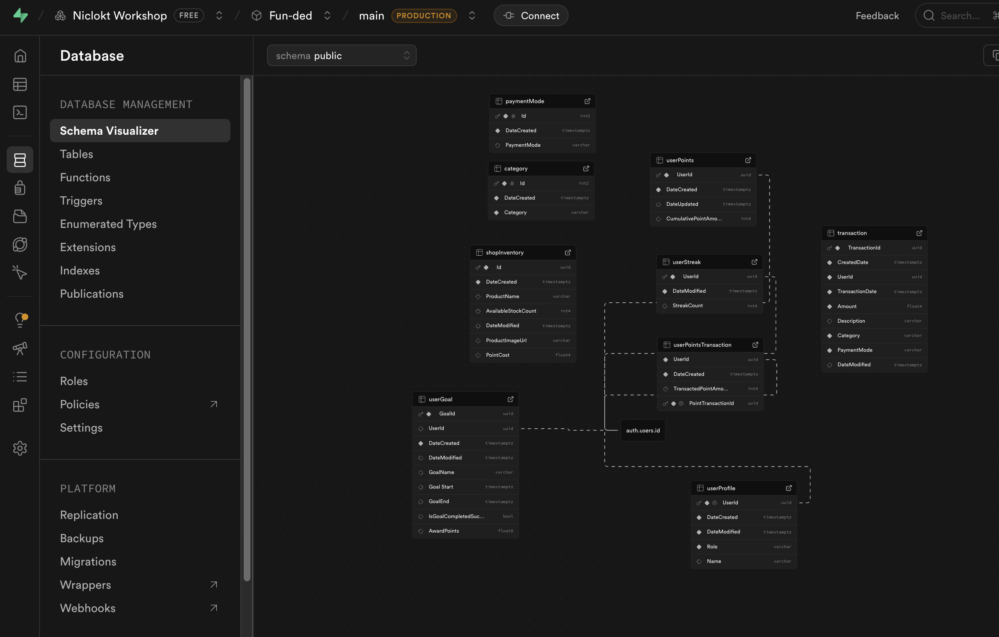

# Software Engineering Project

> Weekly Log - Individual Submission

<br>

| Name         | Team | Student ID |
| ------------ | ---- | ---------- |
| `Nicole Low` | NA   | `2526889A` |

<br>

## Week 3

### 1 - Objectives of the Week (1 mark)

> _(List the key goals or tasks planned for this week)_

1. ✅ Connect database to project
2. Setup Login authentication
    - How to automatically create userProfile data after user has signed up
    - Reference
        - [How to setup login/logout paths](https://youtu.be/WWwDL9G9xkU?si=EgFdBGp76VGZtxmy)
3. Start implementing features for Transactions
    - Feature to filter transactions
    - Feature to download csv files
4. Start implementing features for Overview
    - Figure out how to implement charts
5. Implement Habits page
6. Implement points system
7. Implement Product Page
8. Implement Product Redemption modal

<br>

### 2 - Activities Completed for the Week (1 mark)

> _(Describe developments done, including methods, tools, and technologies. Please provide screenshots where applicable.)_

- [x] Connect database to project
    - Database used: Supabase
- [x] Design database and create tables
    - 

<br>

### 3 - Challenges Encountered (1 mark)

> _(Mention any difficulties or issues faced and how they were addressed)_

- Challenge 1: Designing Databases
    - Took a while to consider how to save data, based on the use case and expected flow of data
    - Addressed this by breaking this down feature by feature, to understand what table would each feature need to store its data.

<br>

### 4 - Reflections (1 mark)

> _(Did you receive any feedback from your teammates, and how did you address or resolve it? Did you manage to complete the tasks you intended to finish this week? What will be your top priority for next week?)_

```
Progress was slow for the week. Spent quite a bit of time setting up the database.
Priority for next week would be to start on the UI and implementing the web application code
```

<br>
